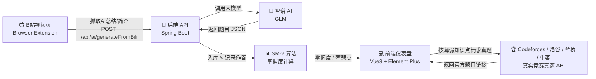

# AI 学习追踪系统 | AI Learning Tracker

> 基于 B站无感追踪、AI 出题检验、SM-2 掌握度追踪与竞赛真题推荐的智能学习系统  
> *A smart learning tracker built on frictionless Bilibili tracking, AI-generated quizzes, SM-2 mastery tracking, and real contest problem recommendations.*


---

## 项目简介 | Project Introduction

「AI 学习追踪系统」致力于把「看视频」这件被动的事，变成一套**可量化、可检验、可追踪**的主动学习闭环。

用户在 B站观看学习类视频时，浏览器插件会在视频播放到 95% 时**无感抓取**视频的 AI 总结 / 简介 / 弹幕 / 评论，自动发送到本地后端；后端调用智谱 AI 针对知识点生成「选择题 + 简答题」，入库并提示用户去作答。作答后，系统用 **SM-2 算法**计算各知识点的掌握度，在每日仪表盘展示学习情况，并对薄弱知识点自动推荐 **Codeforces / 洛谷 / 蓝桥杯 / 牛客** 等平台上的**真实竞赛真题**——绝不是 AI 凭空编造的题目。

*This project turns passive video-watching into a measurable learning loop: a browser extension silently captures Bilibili video content, the backend generates quizzes via Zhipu AI, answers are evaluated by the SM-2 spaced-repetition algorithm, and weak knowledge points are paired with real contest problems from Codeforces / Luogu / Lanqiao Cup / Nowcoder.*

---

## 系统架构 | Architecture

下图展示了数据从「B站」流转到「真实竞赛真题」的完整链路：



*Data flow: Bilibili extension → backend API → Zhipu AI → SM-2 mastery engine → frontend dashboard → real contest problem APIs.*

---

## 核心功能亮点 | Key Features

### 1. 无感自动追踪 | Frictionless Auto-Tracking
浏览器插件（Manifest V3，兼容 Edge / Chrome）注入 B站视频页，监听播放进度。当视频播放至 **95% 或结束**时，自动按优先级抓取素材（AI 视频总结 → 视频简介 → 热门弹幕 → 评论），无需用户手动复制粘贴，真正做到「看完即出题」。按 **BV 号幂等去重**，同一视频只会出一次题。

*The MV3 extension auto-captures video material at 95% progress and deduplicates by BV id—no manual copy-paste.*

### 2. AI 智能出题 | AI Quiz Generation
后端将抓取到的素材拼接为结构化 Prompt，调用智谱 GLM 生成 **3 道**涵盖「选择题 + 简答题」的题目，并附带答案与解析。接口内置**指数退避重试**（429 限流自动等待 2s / 4s / 8s 重试，最多 3 次），并在失败时返回友好中文提示（如「AI 服务器当前繁忙，请稍后重试」），彻底告别 undefined 与英文报错。

*Backend calls Zhipu AI to generate 3 quizzes with auto retry on rate-limit (429) and friendly Chinese error messages.*

### 3. 掌握度追踪 | Mastery Tracking (SM-2)
每道作答记录都会被回放，使用经典 **SM-2 间隔重复算法**按知识点维护「容易度因子 EF」与「下次复习日期」。系统汇总每日答题数、正确率、学习时长，并计算整体掌握度，自动列出**最薄弱的 5 个知识点**，让学习者清楚知道该补哪里。

*Every answer feeds an SM-2 engine that tracks per-topic easiness factor and next-review date; the dashboard surfaces daily stats and the 5 weakest topics.*

### 4. 真实竞赛真题推荐 | Real Contest Problem Recommendations
针对薄弱知识点，系统调用 **Codeforces 公开 API** 拉取真实比赛真题（带官方题目链接），并按知识点映射到对应标签（如「动态规划 / 背包」→ `dp`、「图论」→ `graphs`）。当无匹配或接口不可达时，自动降级为**洛谷 / 蓝桥杯 / 牛客**的搜索链接兜底。**所有推荐题目均来自真实平台，绝不由 AI 编造。**

*Weak topics trigger real Codeforces problems (tag-mapped) with official links, falling back to Luogu / Lanqiao / Nowcoder search URLs—never AI-fabricated.*

---

## 本地启动指南 | Getting Started

> 前置依赖：JDK 17+、Node.js 18+、Maven 3.8+、一个可用的智谱 AI API Key（设置环境变量 `ZHIPU_API_KEY`）。  
> *Prerequisites: JDK 17+, Node 18+, Maven 3.8+, and a `ZHIPU_API_KEY` environment variable.*

### 1. 启动后端 | Start Backend
```bash
# 进入后端目录
cd backend
# 配置智谱 API Key（Linux / macOS）
export ZHIPU_API_KEY=你的密钥
# Windows PowerShell
# $env:ZHIPU_API_KEY="你的密钥"
# 启动（默认端口 8080）
mvn spring-boot:run
```

### 2. 启动前端 | Start Frontend
```bash
# 新开一个终端，进入前端目录
cd frontend
# 安装依赖（首次）
npm install
# 启动开发服务器（默认端口 5173）
npm run dev
```
启动后访问 http://localhost:5173 即可使用「每日仪表盘 / 作答 / 全部题目」等页面。

### 3. 加载 Edge 浏览器插件 | Load the Edge Extension
1. 打开 Edge，地址栏输入 `edge://extensions`，回车；
2. 打开左侧 **「开发人员模式」** 开关；
3. 点击 **「加载解压缩的扩展」**，选择项目根目录下的 `browser-extension/` 文件夹；
4. 插件加载完成后，打开一个 B站视频页，悬浮窗会出现在右上角；
5. 打开悬浮窗里的 **「学习模式」** 开关，观看学习视频至 95%，即可自动出题；
6. 回到 http://localhost:5173/quiz 作答，掌握度与真题推荐会同步更新。

> 提示：后端（8080）与前端（5173）都启动后，插件才能正常通信。若推送代码遇到 HTTPS 证书报错，可能是网络存在 TLS 拦截代理，可对本仓库设置 `git config http.sslVerify false` 后重试。  
> *Tip: keep both backend and frontend running before using the extension. If `git push` fails with a TLS/certificate error, your network may have an intercepting proxy—set `git config http.sslVerify false` for this repo.*

---

## 目录结构 | Project Structure

```
AI-Learning-Tracker/
├── backend/                 # Spring Boot 后端（出题 / 掌握度 / 真题推荐 API）
├── frontend/                # Vue3 + Element Plus 前端（仪表盘 / 作答页）
├── browser-extension/       # Edge / Chrome MV3 插件（B站无感追踪）
├── start.bat / start.vbs    # 一键启动脚本
└── README.md
```

---

## 许可证 | License

本项目基于 MIT License 开源。  
*Released under the MIT License.*
